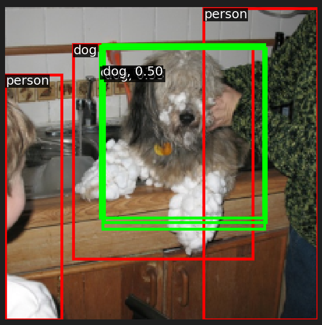
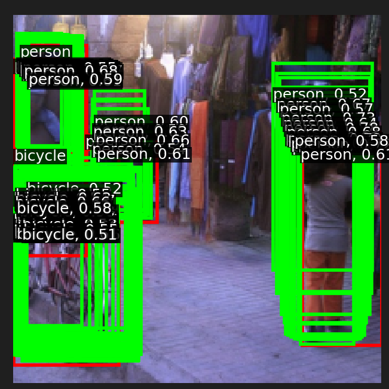
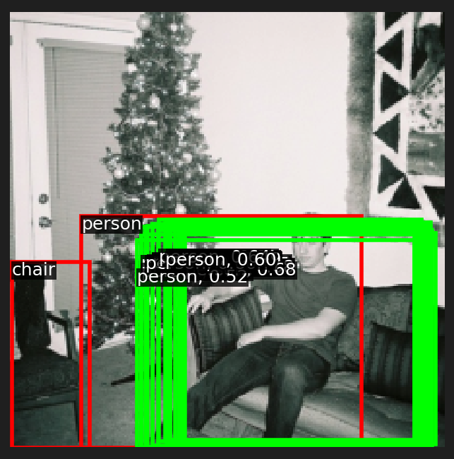
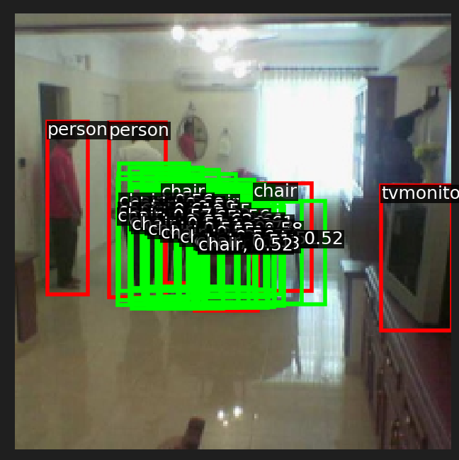

# FCOS Object Detection Module

## Overview

This Python module implements the FCOS, a one-stage object detector that does not rely on anchor boxes. Instead, it predicts the class and location of objects directly from the features at different levels of the feature pyramid network (FPN). This approach simplifies the architecture and improves efficiency, making it suitable for real-time applications.

## Results

#### detection examples

## File Structure

- `fcos.py`: Main module file containing all classes and functions for the FCOS detector.
- `tools/`: Directory containing support modules like data loading utilities.
- 'fcos.ipynb': Run the demo of fcos.

## Classes and Functions

### DetectorBackboneWithFPN

- **Description**: Implements a detection backbone network with a tiny RegNet model coupled with a Feature Pyramid Network (FPN). It processes input images and outputs multi-scale feature maps.
- **Inputs**:
  - `out_channels`: Number of output channels for each FPN level.
- **Outputs**: Multi-scale feature maps at different FPN levels (p3, p4, p5).

### FCOSPredictionNetwork

- **Description**: Contains the prediction layers for the FCOS detector. It predicts class probabilities, bounding box regressions, and 'centerness' scores from each location on the feature maps provided by the FPN.
- **Inputs**:
  - `num_classes`: Number of classes for object detection.
  - `in_channels`: Number of input channels from the FPN.
  - `stem_channels`: List specifying the number of channels in each convolution layer of the stem.
- **Outputs**: Predictions for class logits, box regression deltas, and centerness scores.

### Helper Functions

- `hello_fcos()`: A simple function to test module import and function calls.
- `nms()`, `compute_iou()`, `class_spec_nms()`: Functions to perform non-maximum suppression and calculate intersection over union for filtering bounding box predictions.
- `get_fpn_location_coords()`: Calculates absolute coordinates for each location in the FPN feature maps.
- `fcos_match_locations_to_gt()`, `fcos_get_deltas_from_locations()`, `fcos_apply_deltas_to_locations()`, `fcos_make_centerness_targets()`: Functions to match feature map locations with ground truth boxes, compute and apply deltas for bounding box regression, and compute centerness targets.

## Usage

- **Initialization**: Create an instance of `DetectorBackboneWithFPN` and `FCOSPredictionNetwork`.
- **Training**: Pass batches of images and corresponding ground truth boxes to the forward method of the `FCOS` class.
- **Inference**: Provide an image to the forward method with the `test_score_thresh` and `test_nms_thresh` parameters to receive processed predictions.

## Requirements

- Python 3.6+
- PyTorch 1.4+
- torchvision 0.5+

## Contributing

Feel free to fork the repository, make changes, and submit pull requests. For major changes, please open an issue first to discuss what you would like to change.
